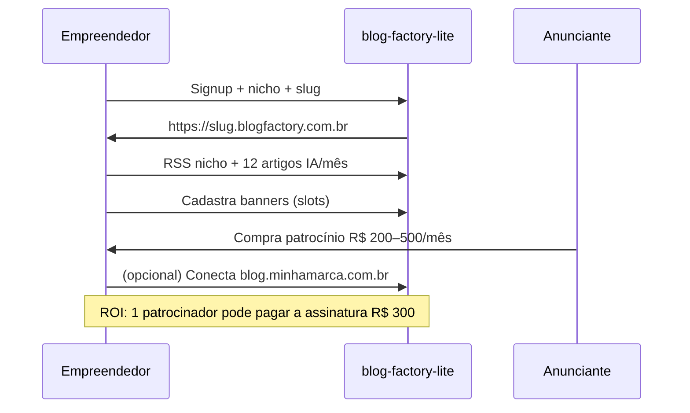

# Blog Factory Lite — documento orientativo (novo repo)

> **Escopo:** produto **comercial simplificado** em **outra pasta/repositório**, reutilizando o **motor** do `strong-sphere` **sem alterar** o projeto IAE atual.
>
> **Ideia mínima:** cada cliente (PF ou PJ) tem **um blog de nicho** para **monetizar com banners**, em subdomínio **`{slug}.blogfactory.com.br`** ou, quando quiser, **domínio próprio** apontando para o mesmo blog.

---

## 0. Público-alvo e posicionamento comercial

### Para quem é (ICP)

**Não** é foco principal: gestão pública / prefeituras (casos como Louveira ficam na operação **strong-sphere** IAE).

**Foco Lite:**

| Persona | Motivação |
|---------|-----------|
| **PF / empreendedor solo** | Blog de nicho (hobby, afiliado, creator) + vender espaço a parceiros |
| **PJ local** | Academia, clínica, loja, profissional liberal — **mídia própria** + patrocínio |
| **Pequeno publisher** | Operar 1 blog vertical (moda regional, pets, finanças pessoais, etc.) e **vender banners** |

### Proposta de valor (pitch)

> **Blog de nicho pronto para monetizar**  
> Até 12 artigos com IA por mês, posts avulsos ilimitados, painel para **vender banners** nos slots do site.  
> Começa em `{slug}.blogfactory.com.br`; quando crescer, **aponta o domínio que já tem** para o blog.

### O que vendemos vs. o que o cliente constrói

| Produto entrega | Cliente ainda precisa |
|-----------------|----------------------|
| Site, tema, posts, comentários, slots de anúncio | **Tráfego** (SEO, redes, indicação) |
| Inventário (páginas + impressões/cliques) | Fechar venda com anunciantes locais |
| Conteúdo IA + manual | Revisar tom antes de publicar |

---

## 1. Visão da ideia mínima (MVP)

### O que o cliente vê

1. **Cadastro** (e-mail + senha) ou convite beta.
2. **Wizard curto:** nome do blog, **nicho**, tom, RSS opcional (feeds do nicho), logo opcional.
3. Sistema cria tenant com hostname inicial **`{slug}.blogfactory.com.br`** (ex.: `crossfit-vila.blogfactory.com.br`).
4. Painel **`/app/*`** (cliente, não admin IAE):
   - Sugerir pautas (RSS + IA)
   - Aprovar pautas → gerar artigo + capa (conta na cota)
   - Criar **posts avulsos manuais** (sem limite, sem cobrança extra)
   - Publicar / agendar
   - Moderar comentários
   - **Monetização:** cadastrar banners (topo, corpo, lateral) + placeholders
5. Visitante abre o blog pela URL pública (subdomínio ou domínio próprio).

### URLs: subdomínio + domínio próprio

**Entrada (sempre):** `https://{slug}.blogfactory.com.br`

- Cara profissional; link no menu **“Blog”** do site principal do cliente (`www.loja.com.br` → blog no subdomínio).

**Evolução (incluído no produto, wizard no painel):**

O cliente **pode direcionar o domínio que já possui** para o mesmo blog:

```text
blog.minhamarca.com.br   ou   conteudo.minhamarca.com.br   ou   minhamarca.com.br
         ↓ DNS (ALIAS/CNAME + TXT Railway)
         ↓
Tenant.hostname atualizado para esse domínio (canonical)
Subdomínio blogfactory pode redirecionar 301 → domínio próprio
```

Reutilizar padrão já validado no strong-sphere (`middleware.ts`, `publicHostRedirects.ts`, Louveira):

| Passo | Onde |
|-------|------|
| Cliente informa domínio desejado no `/app/settings/domínio` | Lite |
| App mostra instruções: ALIAS `@` ou CNAME `www` + TXT `_railway-verify` | Copiar UX do fluxo Railway |
| Cliente configura DNS no Registro.br / DreamHost / etc. | Externo |
| Cliente adiciona domínio em **Custom Domains** no Railway Lite (automatizar ou checklist) | Ops / futuro API Railway |
| Webhook ou job verifica DNS → `Tenant.customDomain` + `hostname` migrado | Lite DB |
| Middleware: `www` → apex, `http` → `https` | Já no motor |

**Regra de produto:** 1 tenant = 1 blog = **1 hostname canónico** (subdomínio *ou* domínio custom, não dois blogs).

### O que fica **fora** do MVP Lite

| Recurso strong-sphere | Lite MVP |
|----------------------|----------|
| Multi-blog operador IAE | 1 blog/conta (upsell = 2º tenant) |
| AdSense + Amazon afiliados | **Adiar** — foco **banners vendidos pelo cliente** |
| Clonagem tenant, admin pesado | Super-admin mínimo + botão no IAE |
| Gestão pública como case de marketing | Fora do posicionamento Lite |

### Definição “pronto para vender”

- Signup → blog no ar em subdomínio **< 10 min**
- **≥ 1 artigo** (IA ou manual)
- **≥ 1 banner** ou placeholder configurado
- Comentários + share nos posts
- Wizard **“Conectar meu domínio”** documentado (mesmo que verificação manual no beta)

---

## 2. O que copiar do motor (`strong-sphere`)

### Núcleo editorial

| Origem | Função |
|--------|--------|
| `src/lib/contentGenerator.ts` | Pautas RSS/JSON/XML, OpenAI artigo + capa |
| `src/lib/cms.ts` | CRUD tenant/post/pitch — **reduzir** |
| `src/pages/admin/generator.astro` | Pautas → aprovar → escrever |
| `src/pages/admin/post/[id].astro`, `posts.astro` | Posts |
| `src/lib/objectStorage.ts`, `bannerResize.ts` | Capas + banners |

### Site público + domínio

| Origem | Função |
|--------|--------|
| `src/pages/t/[hostname]/*` | Home, post, arquivo, sobre, contato |
| `src/middleware.ts`, `src/lib/publicHostRedirects.ts` | Host → tenant; www→apex; http→https |
| `src/lib/tenantUrls.ts` | Paths e normalização hostname |

### Comentários + monetização (core do ICP)

| Origem | Função |
|--------|--------|
| `src/pages/admin/monetization.astro`, `Ad`, `AdPlaceholder` | **Vender banners no nicho** |
| `src/pages/api/ads/click.ts` | Cliques / stats |
| `src/lib/comments.ts`, `admin/comments.astro` | Comentários |

---

## 3. O que construir do zero (gaps SaaS)

### 3.1 Modelo de conta

```text
Account (email, asaas*, subscriptionStatus, aiArticlesUsed, …)
  └── Tenant (1:1 MVP)
        hostname          # slug.blogfactory.com.br OU dominio.com.br
        blogfactorySlug   # slug fixo (redirect legado)
        customDomain      # opcional, domínio canónico após conexão
        Posts, Pitches, Comments, Ads…
```

### 3.2 Hostname: subdomínio + domínio próprio

**Fase 1 — signup**

```text
Tenant.hostname = "academia-centro.blogfactory.com.br"
```

**Fase 2 — cliente conecta domínio**

```text
Tenant.hostname = "blog.academia-centro.com.br"   # canónico
Tenant.blogfactorySlug = "academia-centro"       # redirect 301 de academia-centro.blogfactory.com.br
```

Lookup middleware: `getSiteDataByHostname(host)` resolve por hostname **ou** alias `*.blogfactory.com.br` → mesmo tenant.

### 3.3 Painel cliente vs IAE

| Rota | Quem |
|------|------|
| `/app/*` | Cliente (conta própria) |
| `/app/settings/domain` | Wizard DNS domínio próprio |
| `/app/monetization` | Banners (destaque comercial) |
| strong-sphere `/admin/lite-subscribers` | IAE — 1 botão, lista via API |

### 3.4 Cobrança — Asaas

**Plano:** ~**R$ 300/mês** fixo.

| Incluso | Sem cobrança extra |
|---------|-------------------|
| Até **12 artigos IA + capa/mês** (gerador) | **Posts avulsos manuais** ilimitados |
| Subdomínio + **conexão de domínio próprio** | Sugerir pautas (sem consumir cota de artigo) |
| Comentários, banners, share | |

**Contador:** incrementar só em `generateArticleFromPitch` / batch do gerador; bloquear “Gerar artigos” ao atingir 12/mês; manuais sempre liberados.

**Webhook:** `POST /api/billing/asaas` → `subscriptionStatus` (active / overdue / canceled).

### 3.5 Limites e tiers futuros (opcional)

| Plano | Preço | IA | Domínio |
|-------|-------|-----|---------|
| **Lite** (MVP) | R$ 300 | 12/mês | Subdomínio + **domínio próprio** |
| Starter (futuro) | R$ 99–149 | 4/mês | Só subdomínio |

MVP pode lançar só Lite; Starter se PF achar R$ 300 alto no teste beta.

---

## 4. Arquitetura mínima (novo repo)

```text
blog-factory-lite/
├── prisma/schema.prisma
├── src/middleware.ts              # Host → tenant (+ redirects)
├── src/lib/publicHostRedirects.ts # copiar/adaptar
├── src/lib/contentGenerator.ts
├── src/lib/cms.ts
├── src/lib/billing/asaas.ts
├── src/pages/app/                 # generator, posts, monetization, settings/domain
├── src/pages/api/billing/asaas.ts
└── src/pages/api/internal/subscribers.ts   # IAE read-only
```

Deploy: Railway + Postgres + R2 **separados** do strong-sphere.

---

## 5. Fluxo comercial (empreendedor de nicho)



---

## 6. Checklist de implementação

### Sprint 0 — Infra
- [ ] `blogfactory.com.br` + wildcard `*.blogfactory.com.br`
- [ ] Repo Lite + Postgres + R2

### Sprint 1 — Conta + subdomínio
- [ ] Account + Tenant + `/app` auth
- [ ] Middleware Host → tenant

### Sprint 2 — Motor + Asaas + cota 12 IA
- [ ] Generator + posts manuais ilimitados
- [ ] Webhook Asaas

### Sprint 3 — Público + **monetização (banners)** + comentários
- [ ] `/app/monetization` como feature central na onboarding
- [ ] Stats clique/impressão na venda para anunciante

### Sprint 4 — Domínio próprio + beta
- [ ] `/app/settings/domain` + instruções DNS (ALIAS/CNAME/TXT)
- [ ] Redirect subdomínio → domínio canónico
- [ ] 5–10 betas PF/PJ nicho (fitness, clínica, e-commerce local, etc.)

### Sprint 5 — IAE
- [ ] Botão strong-sphere → `GET /api/internal/subscribers`

---

## 7. Integração mínima no strong-sphere

Um botão **“Clientes Blog Factory Lite”** → tabela `{ slug, url, email, status Asaas, aiUsed/12 }` via API + `LITE_OPS_SECRET`. Sem cobrança duplicada no IAE.

---

## 8. Riscos e mitigação

| Risco | Mitigação |
|-------|-----------|
| Cliente espera tráfego “de graça” | Landing: produto = **mídia + inventário**; SEO vem com 12 posts consistentes |
| R$ 300 alto para PF iniciante | Beta PJ-first; tier Starter depois |
| DNS domínio próprio = suporte | Wizard passo a passo; vídeo; verificação automática quando possível |
| Wildcard SSL | Testar cedo; Cloudflare se necessário |
| Conteúdo IA genérico | RSS do nicho + briefing + aprovação de pauta |

---

## 9. Relação strong-sphere × Lite

| strong-sphere (IAE) | blog-factory-lite |
|---------------------|-------------------|
| N tenants, operador | 1 blog / conta PF-PJ |
| Casos institucionais (Louveira) | **Empreendedor + nicho + banners** |
| Domínios custom operados | Cliente **conecta o domínio dele** ao blog |
| AdSense/Amazon | Banners proprietários |
| Quase intocado | + botão lista assinantes |

---

## 10. Modelo comercial (resumo)

| Item | Valor |
|------|--------|
| **ICP** | PF/PJ empreendedor — blog de nicho + **vender anúncios** |
| Preço | **R$ 300/mês** |
| Cota IA | **12 artigos + imagens/mês** |
| Posts manuais | **Ilimitados** |
| URL inicial | `{slug}.blogfactory.com.br` |
| Domínio próprio | **Sim** — cliente aponta DNS → mesmo blog (hostname canónico) |
| Pagamento | **Asaas** webhook |
| IAE | 1 botão lista clientes Lite |

---

## 11. Próximo passo

1. Criar repo `blog-factory-lite` + copiar este doc.
2. Sprint 0–1: signup + subdomínio + banners na onboarding.
3. Validar com **3 empreendedores de nicho** (não gestão pública).
4. Sprint 4: wizard domínio próprio reutilizando playbook Louveira/Railway.

---

*Atualizado a partir do `strong-sphere` (maio/2026). ICP: empreendedor/nicho/monetização por banner. Domínio próprio: cliente direciona DNS para o blog.*
